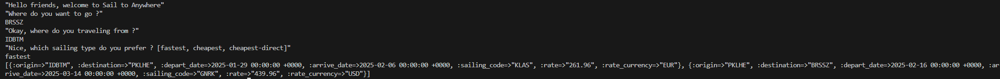

# Route Calculator
[](https://www.ruby-lang.org/en/news/2022/12/25/ruby-3-2-0-released/)

A lightweight route calculation tool built with plain [Ruby](https://www.ruby-lang.org/en/).  
No Rails, no frameworks — just clean, testable Ruby.

---

## 🚀 Setup

Clone the repo and build the Docker image:

```bash
docker-compose build
```

or if you prefer raw Docker

```bash
docker build -t route_calculator .
```

## ▶️ Run the App
Using Docker Compose:
```bash
docker-compose run --rm app
```
or using Plain Docker
```bash
docker run -it --rm route_calculator
```

without docker
```bash
ruby main.rb
```

You'll be prompted to type your destination, origin, and select a route strategy (e.g., fastest, cheapest, etc.) , then it will print the result



## 🧼 Cleanup
```bash
docker container prune
```

## 🧪 Run the Tests
With Docker Compose:

```bash
docker-compose run --rm test
```

Or using plain Docker:

```bash
docker run --rm route_calculator rspec
```